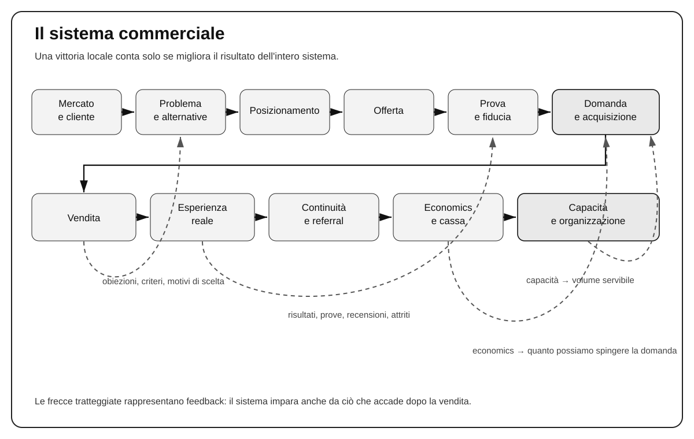
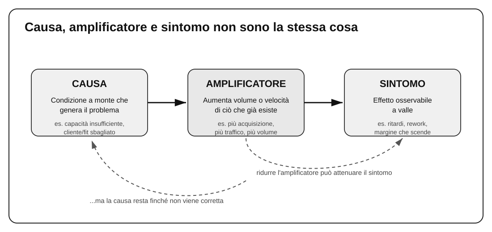

# Capitolo 1 — Il sistema di marketing

Il marketing entra spesso nell'impresa quando molte delle decisioni che dovrebbe contribuire a orientare sono già state prese. Il prodotto esiste, il prezzo è stato scelto, il tipo di cliente viene dato per scontato, la vendita ha trovato nel tempo un proprio modo di funzionare e l'organizzazione si è adattata come ha potuto. A quel punto, quando le vendite rallentano o l'azienda vuole crescere, si apre il capitolo “marketing” e la domanda diventa quasi sempre operativa: come ottenere più visibilità, più contatti, più appuntamenti, più traffico o più vendite?

È una domanda legittima, ma spesso arriva troppo tardi nel ragionamento. Se il cliente scelto è poco profittevole, se l'offerta è facilmente confrontabile con quella dei concorrenti, se il prezzo non sostiene il livello di servizio promesso o se l'organizzazione non riesce ad assorbire altra domanda, aumentare la promozione non risolve il problema. Può addirittura renderlo più costoso, perché porta più volume dentro un sistema che era già fragile.

Per questo, nel resto del manuale, useremo il termine *marketing* in un senso più ampio della sola comunicazione. Il marketing riguarda l'insieme delle decisioni con cui un'impresa sceglie dove competere, quali clienti desidera acquisire, quale valore vuole creare per loro, perché dovrebbe essere preferita, che cosa offre, a quale prezzo, come porta quella proposta sul mercato e come verifica che tutto il meccanismo produca un risultato economico sostenibile.

La pubblicità, i contenuti, il sito, le email, gli eventi, le telefonate commerciali e gli altri mezzi con cui l'impresa si fa conoscere sono quindi importanti, ma vengono dopo alcune decisioni fondamentali. Sono strumenti di distribuzione e di persuasione. Non possono decidere al posto dell'impresa quale mercato servire, quale promessa sia realmente sostenibile o quali clienti meritino di essere acquisiti.

Questa distinzione è il punto di partenza del libro perché cambia il modo di affrontare quasi ogni problema commerciale. Se una campagna non produce vendite, la soluzione potrebbe essere una campagna migliore. Ma potrebbe anche essere un'offerta debole, un posizionamento poco chiaro, un prezzo incoerente, un processo di vendita lento o un mercato con poca domanda. Se le vendite aumentano ma il margine scende, il problema non si risolve congratulandosi con il reparto commerciale: bisogna capire che cosa sta entrando nel sistema e che cosa succede dopo la firma del contratto. Se i clienti comprano ma abbandonano presto, aumentare l'acquisizione può significare semplicemente comprare più velocemente un problema di erogazione o di selezione del cliente.

È qui che diventa utile pensare all'impresa come a un sistema. Un sistema è fatto di parti diverse che producono effetti l'una sull'altra. Il mercato influenza il tipo di offerta che può avere senso; l'offerta influenza il processo di vendita; il tipo di vendita influenza i costi e i tempi di acquisizione; i clienti acquisiti modificano il carico operativo; la qualità dell'esperienza influenza retention, referral e reputazione; margine e cassa stabiliscono quanto l'impresa può reinvestire senza mettersi in difficoltà.

Il compito di questo primo capitolo è costruire quella mappa generale. Non entreremo ancora nei dettagli di ogni elemento: mercato, posizionamento, offerta, prezzo, acquisizione, vendita, esperienza, economia e capacità avranno capitoli dedicati. Qui interessa soprattutto imparare a vedere i collegamenti. È una competenza meno spettacolare di una nuova tattica, ma molto più importante: senza di essa si rischia di migliorare una parte dell'impresa peggiorando il risultato complessivo.

## 1.1 Marketing e promozione

Promuovere significa portare una proposta davanti a più persone adatte e favorire un'azione: una richiesta, una visita, un appuntamento, una prova, un ordine, un acquisto. La promozione è quindi una funzione indispensabile. Un'impresa può avere un prodotto eccellente e fallire comunque se nessuno sa che esiste o se non riesce a raggiungere chi potrebbe comprarlo.

Il problema nasce quando la promozione viene trattata come se coincidesse con tutto il marketing. In quel momento l'impresa consegna a una campagna un compito che la campagna non può svolgere: correggere decisioni prese altrove.

Supponiamo, per esempio, che uno studio professionale serva indistintamente clienti molto diversi. Alcuni sono profittevoli, collaborativi e rimangono per anni; altri richiedono moltissimo tempo, contestano ogni attività e comprano una sola volta. Se lo studio chiede al marketing semplicemente di “portare più clienti”, la campagna può fare esattamente ciò che le viene chiesto e peggiorare l'impresa. Il problema non è il numero di contatti. È che a monte non è stato deciso quali clienti valga davvero la pena acquisire.

Lo stesso accade quando il prodotto è poco differenziato. Un'impresa può investire molto per attirare attenzione e scoprire poi che, una volta arrivati davanti all'offerta, i potenziali clienti confrontano quasi esclusivamente il prezzo. Qui il reparto pubblicitario può migliorare creatività, targeting e costo per contatto, ma resta intrappolato in una debolezza che non ha creato: il mercato non vede una ragione abbastanza forte per preferire quell'impresa.

È importante capire questa dinamica perché modifica anche il rapporto con consulenti, agenzie e fornitori. Se a un'agenzia viene consegnato un prodotto già definito, un prezzo intoccabile e un target generico con l'ordine di “fare marketing”, in realtà le viene assegnato soprattutto un problema di comunicazione e distribuzione. Potrà eseguire quel lavoro bene o male, ma non potrà risolvere da sola tutte le decisioni economiche e strategiche che precedono la campagna.

Un approccio più maturo parte da una domanda diversa: **che cosa deve essere vero perché la promozione abbia senso?** Devono esistere almeno un mercato abbastanza interessante, clienti che l'impresa desidera realmente servire, una proposta comprensibile, una ragione credibile per scegliere l'azienda e un'economia che renda conveniente acquisire quei clienti. Se uno di questi elementi manca, la comunicazione può ancora produrre attività, ma l'attività non coincide automaticamente con un buon risultato.

Questo non significa che ogni problema sia “strategico” e che la promozione non possa semplicemente essere fatta male. Una campagna può avere un messaggio confuso, un modulo può non funzionare, il targeting può essere sbagliato, il sito può essere lento, la chiamata all'azione può essere quasi invisibile. Quando il sistema a monte è sano e il problema è locale, la soluzione corretta è locale. Cercare sempre una spiegazione profonda può diventare un modo sofisticato per ignorare un errore banale.

La distinzione utile è quindi molto concreta: prima di cambiare una tattica, bisogna sapere quale risultato quella tattica dovrebbe produrre e quali condizioni deve trovare già presenti. Se l'impresa possiede una buona offerta per clienti economicamente validi ma nessuno la vede, il problema di distribuzione è reale. Se invece l'offerta è indistinguibile e il margine insufficiente, comprare più attenzione significa pagare per esporre più velocemente una debolezza.

Per un imprenditore questa è una regola pratica importante: **non chiedere al marketing di correggere ciò che l'impresa non ha ancora deciso**. Il marketing deve poter riportare informazioni a monte e, quando serve, costringere a ripensare target, prodotto, prezzo, processo o servizio. In caso contrario viene ridotto a un reparto che cerca di vendere meglio qualunque cosa gli venga consegnata.

## 1.2 L'impresa come sistema commerciale

Per capire dove finisce una tattica e dove comincia il problema dell'impresa serve una rappresentazione più ampia. La forma cambia tra un ecommerce, uno studio professionale, un produttore industriale e un'attività locale, ma le grandi dipendenze sono sorprendentemente simili.

Tutto parte da un mercato: persone o organizzazioni che hanno problemi, desideri, alternative e capacità di spesa diverse. L'impresa non può servire quel mercato in modo astratto; deve scegliere quali clienti vuole attrarre e quali preferisce non attrarre. Da questa scelta nasce il problema successivo: perché quei clienti dovrebbero preferire proprio questa impresa rispetto alle alternative che hanno già a disposizione?

La risposta orienta posizionamento, prodotto, servizio, offerta e prezzo. Una volta definita la proposta, bisogna renderla visibile attraverso domanda e canali, trasformare interesse in opportunità attraverso l'acquisizione, aiutare le persone ad acquistare attraverso la vendita e infine mantenere la promessa attraverso l'erogazione. Se il cliente riceve davvero valore, la relazione può continuare con nuovi acquisti, rinnovi, referral e reputazione. Se non lo riceve, la promessa commerciale si trasforma in reclami, abbandono e costo.

Alla fine tutto torna ai numeri. Margine, costo di acquisizione, tempi di incasso, capitale necessario e capacità operativa dicono se il meccanismo può sostenersi. Un sistema commerciale non è sano perché “vende”. È sano quando riesce a creare domanda, convertirla, servire il cliente e trattenere abbastanza valore economico da continuare a funzionare e migliorare.

La figura va letta in entrambe le direzioni. Da sinistra verso destra mostra la sequenza con cui una scelta di mercato diventa un risultato economico. Da destra verso sinistra mostra invece il feedback che permette all'impresa di imparare.

La vendita, per esempio, non serve soltanto a chiudere contratti. Raccoglie informazioni preziose: quali alternative vengono confrontate, quali dubbi ricorrono, chi partecipa alla decisione, quali aspettative economiche hanno i clienti, che cosa li convince e che cosa li blocca. Se queste informazioni restano nella testa dei venditori, il marketing continua a lavorare con una rappresentazione incompleta del mercato.

L'erogazione produce un altro tipo di evidenza. Mostra quali clienti ottengono risultati migliori, quali promesse sono difficili da mantenere, quali personalizzazioni consumano tempo, quali problemi ritornano e dove il costo di servizio cresce oltre quanto previsto. Anche questi dati devono poter risalire a monte. Se una certa categoria di clienti compra facilmente ma richiede il doppio del lavoro, la questione non riguarda soltanto l'operatività: può cambiare target, prezzo, offerta e perfino posizionamento.

I numeri completano il ciclo. Un canale può sembrare eccellente perché produce lead a basso costo e rivelarsi mediocre quando si scopre che quei lead richiedono più ore commerciali, comprano offerte meno profittevoli o abbandonano prima. Al contrario, un canale apparentemente costoso può generare clienti con maggiore margine, minore assistenza e valore più lungo nel tempo. Senza collegare acquisizione e post-vendita, entrambe le valutazioni rimangono superficiali.

Questa interdipendenza spiega perché le aziende organizzate in silos possono prendere decisioni razionali localmente e sbagliate nel complesso. Il marketing ottimizza il costo per lead. La vendita vuole massimizzare il tasso di chiusura. L'operatività cerca di ridurre il tempo medio per cliente. L'amministrazione protegge la cassa. Tutti possono migliorare il proprio indicatore e, nello stesso tempo, spostare un costo o un problema su un altro reparto.

Immaginiamo che il marketing trovi una campagna capace di raddoppiare le richieste. Per il team di acquisizione è un successo. Se però la vendita è già satura, il tempo di risposta si allunga e la conversione può scendere. Se anche la vendita riesce a reggere il volume, l'erogazione potrebbe non avere capacità sufficiente e iniziare ad accumulare ritardi. Se per recuperare i ritardi si ricorre a straordinari e fornitori urgenti, il margine può peggiorare. Una vittoria reale in un punto del sistema ha generato un costo altrove.

Il punto non è evitare ogni trade-off. Un'impresa reale vive di compromessi. Il punto è renderli visibili prima di chiamare “successo” un miglioramento locale.

Da qui nasce una disciplina molto semplice: quando una funzione migliora il proprio risultato, bisogna chiedersi che cosa succede **un passaggio più a valle**. Più lead: che qualità hanno e che carico producono sulla vendita? Più vendite: che margine e che carico operativo generano? Più retention: è retention sana o stiamo trattenendo clienti non profittevoli? Più velocità operativa: la qualità è rimasta sufficiente?

Queste domande non sostituiscono i KPI di reparto. Li mettono nel loro posto corretto. Un indicatore locale serve a governare una funzione; il risultato complessivo dell'impresa richiede di vedere come quella funzione si collega alle altre.

## 1.3 Risultati locali e risultato complessivo

Quasi tutti i problemi di misurazione nascono da una confusione tra livelli diversi di risultato. Un numero può migliorare davvero e, nello stesso tempo, non essere il numero giusto per dichiarare che il business sta migliorando.

Conviene distinguere almeno tre livelli. Il primo riguarda l'**attività**: impressioni, chiamate, email inviate, appuntamenti fissati, proposte preparate. Questi numeri dicono che cosa è stato fatto. Il secondo riguarda l'**efficacia operativa**: tasso di risposta, conversione, tempo di presa in carico, tasso di chiusura, tempi di consegna. Dicono quanto bene una fase trasforma un input in un output. Il terzo riguarda il **risultato economico e di capacità**: contribuzione, cassa, costo di acquisizione, valore del cliente, carico operativo, capacità residua.

I tre livelli servono tutti, ma rispondono a domande diverse. Se aumentano le chiamate effettuate, sappiamo che la squadra commerciale ha prodotto più attività; non sappiamo ancora se ha creato più clienti. Se aumenta il tasso di chiusura, sappiamo che una quota maggiore delle opportunità viene convertita; non sappiamo ancora se quei contratti producono margine adeguato. Se aumenta il fatturato, sappiamo che l'impresa vende di più; non sappiamo ancora quanto valore economico rimane dopo acquisizione, erogazione e costi di crescita.

Qui molte imprese commettono un errore preciso: trasformano il KPI che controllano più facilmente nel risultato finale. La piattaforma pubblicitaria mostra il costo per lead, quindi il costo per lead diventa “il risultato”. Il CRM mostra il tasso di chiusura, quindi la chiusura diventa la misura dominante. Il gestionale mostra il fatturato, quindi il fatturato diventa la definizione di crescita.

Il fatto che un numero sia visibile non gli assegna automaticamente la priorità.

Una metrica locale deve essere collegata a una conseguenza più a valle. Un costo per lead più basso è interessante se quei lead diventano clienti con un'economia almeno equivalente. Un tasso di chiusura più alto è positivo se non è ottenuto accettando condizioni che distruggono margine o qualità. Una produzione più veloce è utile se non aumenta errori, rilavorazioni o resi.

Questo porta a una regola operativa molto utile: **ogni KPI locale importante dovrebbe avere almeno un indicatore di qualità o di conseguenza economica associato**. Non serve creare dashboard interminabili. Serve impedire che una funzione ottimizzi il proprio numero scaricando il costo sul resto dell'impresa.

Per esempio, un team commerciale può essere misurato sul tasso di chiusura, ma anche sul margine dei contratti e sulla qualità degli accordi presi. Un canale di acquisizione può essere letto sul costo per vendita, ma anche sul valore successivo delle coorti generate. Un servizio clienti può misurare il tempo di risposta, ma deve controllare anche la risoluzione effettiva e la ricorrenza dei problemi.

A volte, per migliorare il sistema, una metrica locale deve perfino peggiorare. Un venditore può chiudere meno contratti dopo che l'impresa introduce criteri più severi di qualificazione, ma i contratti rimasti possono essere più profittevoli e più facili da servire. Un aumento di prezzo può ridurre la conversione e aumentare comunque la contribuzione complessiva. Un reparto operativo può dedicare più tempo a correggere una causa ricorrente e quindi peggiorare temporaneamente il tempo medio di lavorazione, ma ridurre errori futuri.

Se questa possibilità non viene compresa, i KPI diventano gabbie. Le persone imparano a migliorare il numero che viene premiato, non necessariamente il business.

> **ESEMPIO SVOLTO — Più vendite, meno contribuzione**
>
> Supponiamo che un'impresa di servizi acquisisca normalmente dieci nuovi progetti al mese. Ogni progetto fattura in media 18.000 euro e lascia circa 7.000 euro dopo i costi che crescono direttamente con l'erogazione. Per ottenere quei dieci clienti l'impresa sostiene circa 13.000 euro tra marketing e lavoro commerciale.
>
> Dopo aver aumentato la spesa pubblicitaria, le richieste qualificate passano da 50 a 80 e i progetti acquisiti da 10 a 12. Il fatturato dei nuovi lavori sale da 180.000 a 216.000 euro. Acquisizione e vendite, lette isolate, sono migliorate.
>
> Nello stesso periodo, però, il mix dei lavori diventa più complesso. Straordinari, coordinamento e rilavorazioni riducono ciò che rimane mediamente da ogni progetto da 7.000 a 5.800 euro. I costi complessivi di acquisizione salgono inoltre da 13.000 a 19.000 euro.
>
> |  | Prima | Dopo |
> |---|---:|---:|
> | Richieste qualificate | 50 | 80 |
> | Progetti acquisiti | 10 | 12 |
> | Fatturato nuovi progetti | €180.000 | €216.000 |
> | Valore medio rimasto prima di acquisizione e struttura | €7.000 | €5.800 |
> | Costo complessivo di acquisizione | €13.000 | €19.000 |
> | Contribuzione dopo acquisizione | ~€57.000 | ~€50.600 |
>
> L'impresa vende di più e trattiene meno valore economico dai nuovi lavori. Non sappiamo ancora perché: potrebbe essere cambiato il mix di clienti, potrebbero essere stati accettati progetti più complessi allo stesso prezzo oppure la capacità potrebbe essere diventata insufficiente. Il dato importante, in questa fase, è che il miglioramento commerciale non autorizza ancora a dichiarare migliorato il business.

L'esempio mostra anche un'altra cosa: misurare meglio non significa conoscere automaticamente la causa. I numeri ci dicono dove il risultato si è deteriorato. La diagnosi deve ancora spiegare perché.

## 1.4 Cause, sintomi e amplificatori

Quando un risultato peggiora, la pressione operativa spinge naturalmente verso il punto in cui il problema è più visibile. Se calano le vendite, si interviene sui venditori. Se aumentano i reclami, si interviene sull'assistenza. Se il costo per cliente cresce, si interviene sulla pubblicità. A volte è esattamente ciò che va fatto. Altre volte stiamo correggendo l'effetto più vicino, non la condizione che lo ha prodotto.

Per evitare questa confusione è utile distinguere tre ruoli: causa, amplificatore e sintomo.

La **causa** è una condizione che contribuisce a generare il problema. Un **amplificatore** non deve aver creato il problema, ma ne aumenta la dimensione o la velocità. Il **sintomo** è uno degli effetti osservabili a valle.

La distinzione sembra teorica finché non si prova a prendere una decisione. Riprendiamo l'impresa di servizi dell'esempio precedente. Dopo l'aumento della pubblicità compaiono ritardi, straordinari e minore contribuzione. La tentazione è concludere che “la pubblicità sta attirando clienti sbagliati”. È possibile, ma non è l'unica spiegazione.

Potrebbe essere che la campagna abbia effettivamente cambiato il tipo di cliente acquisito: in quel caso la sorgente o il messaggio potrebbero essere parte della causa. Potrebbe invece essere che l'impresa fosse già vicina al limite di supervisione e che il volume aggiuntivo abbia semplicemente reso evidente una capacità insufficiente. In questo secondo caso la campagna è soprattutto un amplificatore. I ritardi e le rilavorazioni sono sintomi. Potrebbe infine emergere che i lavori più complessi sono sempre stati sottoprezzati: allora la vera debolezza è nell'offerta o nel prezzo, e l'aumento di volume l'ha soltanto resa economicamente dolorosa.

Notare la differenza cambia l'intervento. Se il problema è la qualità della domanda, può avere senso cambiare messaggio, canale o criteri di qualificazione. Se il problema è capacità, il marketing non è il luogo della correzione strutturale, anche se ridurre temporaneamente la domanda può essere necessario per non danneggiare i clienti. Se il problema è il prezzo dei lavori complessi, assumere persone in più rischia di aggiungere costi a un modello che perde già valore per ogni commessa.

Qui entra una distinzione importante tra **contenimento** e **correzione**. Il contenimento serve a limitare il danno immediato. Se l'azienda non riesce a gestire il volume, ridurre temporaneamente la spesa pubblicitaria può essere sensato. La correzione serve invece a rimuovere o modificare la condizione che rende il sistema fragile. Se quella condizione è una capacità insufficiente, bisogna lavorare sulla capacità; se è il pricing, sul pricing; se è la selezione dei clienti, sulla selezione.

Confondere i due livelli produce uno dei comportamenti più costosi nelle imprese: spegnere il sintomo e credere di aver risolto il problema. Quando la pressione cala, tutto sembra tornato normale. Appena il volume riparte, la stessa fragilità ricompare.

Anche l'errore opposto è frequente: cercare per forza una causa profonda quando esiste un guasto locale. Supponiamo che un'impresa abbia domanda stabile, offerta profittevole, capacità disponibile e un processo commerciale che funziona regolarmente. Dopo un aggiornamento tecnico, il modulo del sito smette di inviare una parte delle richieste. Il traffico resta stabile, ma i contatti validi crollano. Qui non serve una revisione del posizionamento: serve correggere il modulo.

Il pensiero sistemico non consiste quindi nell'andare sempre più a monte. Consiste nel **localizzare il problema senza fermarsi automaticamente al punto in cui lo vediamo**. La domanda utile è: quale condizione, se modificata, spiegherebbe davvero il risultato che stiamo osservando?

Nella pratica conviene fare tre mosse mentali. Prima definire il risultato che è cambiato in termini osservabili. Poi risalire almeno di un passaggio e cercare una condizione plausibile che possa averlo prodotto. Infine controllare un'alternativa: che cos'altro potrebbe spiegare lo stesso sintomo? Non serve trasformare ogni decisione in un'indagine infinita; basta evitare la sicurezza artificiale con cui spesso viene scelta la prima spiegazione disponibile.

Questa disciplina diventerà più importante quando parleremo di esperimenti, canali, vendita e capacità. Per ora basta conservarne il principio: **intervenire rapidamente è utile, ma intervenire rapidamente nel punto sbagliato può soltanto rendere più efficiente l'errore**.

## 1.5 Strategia, strumenti e responsabilità

La distinzione tra sistema e tattica diventa ancora più importante quando entrano in gioco strumenti potenti. Software di CRM, automazioni, piattaforme pubblicitarie e sistemi di intelligenza artificiale permettono oggi a una piccola organizzazione di svolgere attività che pochi anni fa avrebbero richiesto più persone, più tempo e più coordinamento.

Questo è un vantaggio reale. Il rischio nasce quando la capacità dello strumento viene scambiata per chiarezza del processo.

Un CRM può ricordare appuntamenti, assegnare opportunità, registrare attività e inviare follow-up. Prima di configurarlo, però, qualcuno deve decidere quali stati della relazione hanno significato. Quando un contatto diventa opportunità? Quali informazioni sono indispensabili prima di passarlo alla vendita? Che cosa rende una trattativa ferma, persa o da riattivare? Quando deve intervenire una persona? Senza queste decisioni il software non risolve l'ambiguità: la rende più ordinata e più veloce.

Lo stesso vale per l'automazione. Automatizzare un processo significa incorporare delle regole in un sistema. Se le regole sono buone, l'automazione crea leva. Se le regole sono confuse, l'automazione moltiplica l'incoerenza. È per questo che “automatizzare prima” raramente è una strategia. Prima bisogna capire che cosa deve accadere, in quale ordine, con quali informazioni e con quali eccezioni.

L'intelligenza artificiale rende il punto ancora più evidente perché può produrre una quantità enorme di output con un costo marginale molto basso. Può sintetizzare ricerche, preparare bozze, classificare segnali, assistere il servizio clienti, proporre un passo successivo o personalizzare una comunicazione. Ma la velocità non decide se il target sia corretto, se la promessa sia sostenibile o se un cliente sia economicamente desiderabile.

Se l'impresa non sa quali clienti vuole acquisire, un sistema automatico può qualificare più velocemente secondo criteri sbagliati. Se non ha definito il posizionamento, può produrre cento annunci coerenti con una proposta generica. Se non conosce i limiti dell'erogazione, può accelerare la vendita fino a creare un problema di capacità.

Questa è la differenza tra **delegare l'esecuzione** e **delegare il giudizio**. L'esecuzione tecnica può e spesso deve essere affidata a specialisti, persone, software o automazioni. Il giudizio sulle variabili fondamentali deve rimanere comprensibile all'interno dell'impresa.

Un imprenditore non deve saper configurare personalmente una campagna pubblicitaria. Deve però sapere quale cliente vale la pena acquisire, quanto può permettersi di pagarlo, quale risultato si aspetta dalla campagna e quale dato lo convincerebbe a continuare o fermarsi. Non deve programmare il CRM, ma deve capire quali passaggi del processo commerciale sono essenziali e quali eccezioni richiedono decisione umana. Non deve addestrare un modello di intelligenza artificiale, ma deve sapere quali informazioni sono affidabili, quali promesse può autorizzare e quando il sistema deve smettere di rispondere e passare la situazione a una persona.

Questa responsabilità è strategica perché tiene insieme le parti del sistema. Quando viene ceduta completamente all'esterno, l'impresa rischia di diventare dipendente da strumenti e fornitori senza essere più in grado di giudicare se stanno migliorando il business o semplicemente aumentando l'attività.

Il primo capitolo può quindi chiudersi con una distinzione semplice ma decisiva. Il marketing non è il reparto che “fa pubblicità”. È il sistema di decisioni che collega mercato, cliente, proposta, acquisizione, vendita, esperienza ed economia. La promozione distribuisce e rende visibile quel sistema. Gli strumenti ne accelerano l'esecuzione. I numeri ci diranno se funziona davvero.

Ed è proprio il linguaggio dei numeri che manca ancora alla mappa. Dire che una campagna “funziona”, che un cliente “vale molto” o che le vendite “stanno crescendo” è troppo vago per decidere. Nel capitolo successivo introdurremo i concetti economici minimi con cui leggere margine, costo di acquisizione, recupero dell'investimento e punto di pareggio. Senza quei numeri, la visione sistemica rimarrebbe corretta ma incompleta.