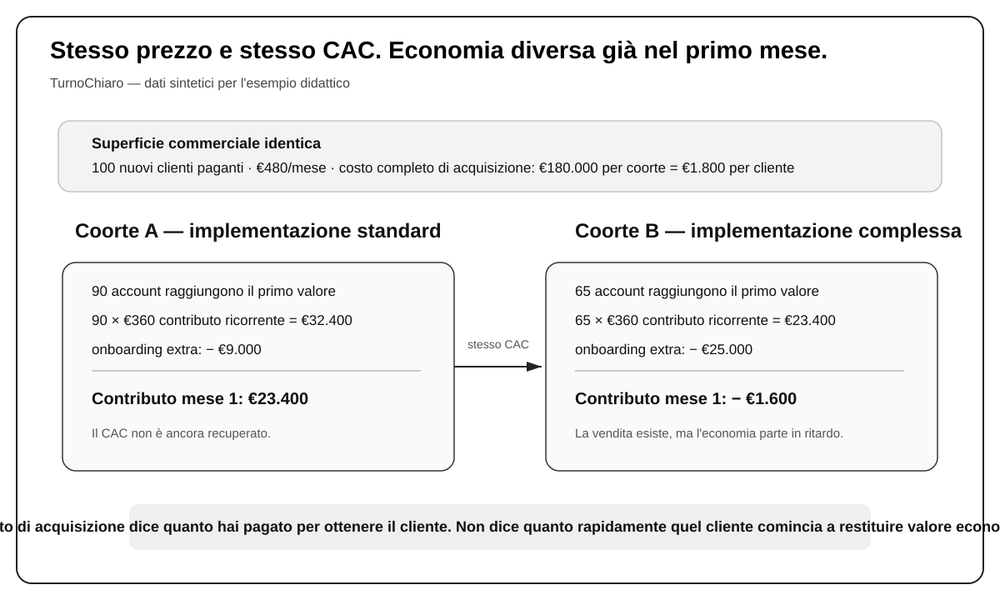
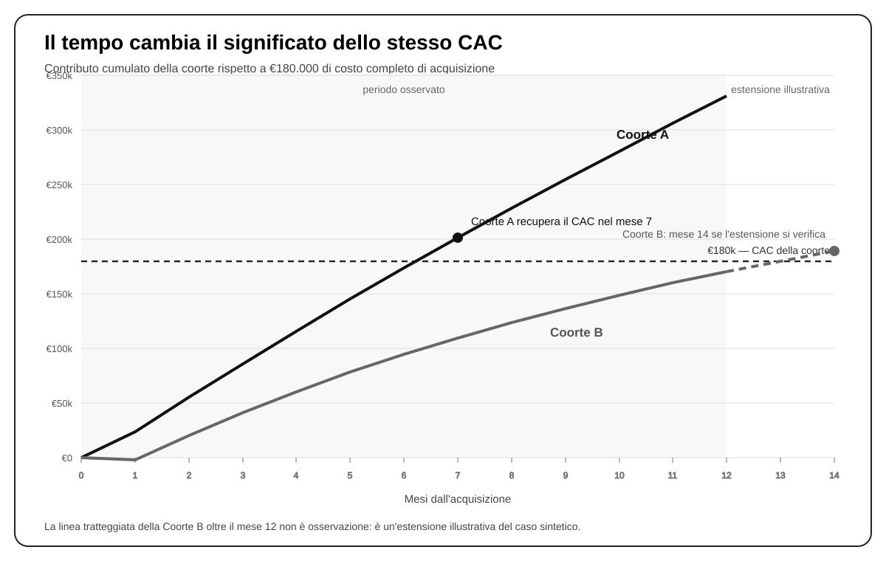

# Capitolo 23 — Quando un cliente merita altra crescita

TurnoChiaro aveva un numero che piaceva a tutti.

Da diversi mesi il costo completo per acquisire un nuovo account pagante oscillava intorno ai 1.800 euro. Il dato comprendeva pubblicità, produzione delle campagne, software usati per acquisire e seguire le opportunità, tempo commerciale e commissioni. Non era il costo di un clic né il costo di una richiesta: era ciò che l’azienda, in media, doveva impiegare perché un nuovo cliente arrivasse davvero alla firma.

Per un software venduto a 480 euro al mese, il numero sembrava ragionevole. Il management lo usava per decidere quanto spingere l’acquisizione e per confrontare le campagne. Finché il CAC rimaneva vicino a 1.800 euro, la macchina commerciale veniva considerata sotto controllo.

Poi qualcuno separò i nuovi clienti in due gruppi.

Entrambi contenevano cento account. Entrambi avevano pagato lo stesso piano da 480 euro al mese. Entrambi erano costati complessivamente 180.000 euro per essere acquisiti: 1.800 euro per account. Se ci fossimo fermati qui, avremmo descritto due coorti economicamente identiche.

Non lo erano.

Nel primo gruppo, composto soprattutto da aziende con due-cinque sedi, una responsabilità operativa abbastanza chiara e processi di turnazione relativamente standard, novanta account riuscivano a completare l’avvio del prodotto nel primo mese. Nel secondo, formato da organizzazioni con più eccezioni, dati più sporchi, responsabilità distribuite e maggiore bisogno di assistenza, soltanto sessantacinque arrivavano allo stesso punto.

Anche il lavoro necessario per portarceli era diverso. Il primo gruppo richiedeva circa 9.000 euro di assistenza aggiuntiva di avvio. Il secondo ne assorbiva circa 25.000.

A quel punto il CAC di 1.800 euro non era diventato falso. Era diventato insufficiente.

La domanda non era più soltanto quanto fosse costato ottenere il cliente. Bisognava capire quanto valore economico quel cliente cominciasse a restituire, con quale velocità e con quanta probabilità di continuare a farlo.

Questa è la ragione per cui l’economia di acquisizione non può essere letta da un singolo numero.

## Dal fatturato a ciò che resta davvero

Prima di confrontare le due coorti serve un passaggio semplice, ma decisivo.

TurnoChiaro fattura 480 euro al mese per un account attivo. Quel numero è ricavo. Non sono 480 euro disponibili per pagare acquisizione, struttura e profitto, perché una parte del denaro viene consumata dal servizio stesso: infrastruttura, assistenza, costi operativi direttamente legati all’account.

Nel nostro caso didattico, questi costi ricorrenti ammontano in media a 120 euro al mese per un account che funziona normalmente. Restano quindi 360 euro.

Quella differenza è il **margine di contribuzione**: il valore economico che la transazione lascia disponibile, prima dei costi fissi e delle altre spese di struttura, per recuperare ciò che abbiamo speso per acquisire il cliente e contribuire al resto dell’impresa.

La relazione è elementare:

> **Contribuzione = ricavi − costi variabili attribuibili al cliente**

Nel caso TurnoChiaro:

> €480 − €120 = **€360 al mese** per un account normalmente attivo.

Il calcolo è facile. La parte importante viene dopo.

Se un cliente è costato 1.800 euro da acquisire, la prima fattura da 480 euro non ha “ripagato il marketing”. Nemmeno i 360 euro di contribuzione del primo mese lo hanno fatto. Il denaro impiegato per ottenere quel cliente deve essere recuperato attraverso la contribuzione che la relazione genera nel tempo.

Questo è il primo motivo per cui confondere ricavi e valore economico produce decisioni sbagliate. Due clienti possono fatturare lo stesso importo e lasciare somme molto diverse dopo assistenza, erogazione, resi, personalizzazioni o altri costi legati al servizio. E anche quando la contribuzione mensile è identica, possono impiegare tempi diversi per raggiungerla.

Nel caso di TurnoChiaro, è esattamente ciò che accade.

Nel primo mese la Coorte A ha novanta account che hanno raggiunto il primo utilizzo reale del prodotto. Novanta per 360 euro producono 32.400 euro di contribuzione ricorrente. Da questa dobbiamo sottrarre i 9.000 euro di lavoro di onboarding aggiuntivo richiesto dal gruppo. Restano 23.400 euro.

La Coorte B parte dallo stesso prezzo e dallo stesso CAC, ma soltanto sessantacinque account arrivano a un utilizzo sufficiente per ricevere valore dal prodotto. Sessantacinque per 360 euro producono 23.400 euro; l’onboarding aggiuntivo ne assorbe 25.000. Il risultato del primo mese è una contribuzione negativa di 1.600 euro.

La vendita è avvenuta in entrambi i casi. L’economia no.

Questa frase va interpretata con attenzione. Non significa che la Coorte B sia “cattiva” per natura o che quel tipo di cliente non debba mai essere servito. Significa che, **con il prezzo, il processo di onboarding, il livello di assistenza e l’organizzazione attuali**, quel gruppo parte con un’economia molto più difficile.

Potremmo cambiare il prodotto. Potremmo far pagare l’implementazione. Potremmo selezionare meglio gli account. Potremmo standardizzare l’importazione dei dati o costruire strumenti che riducano il lavoro umano. Potremmo scoprire che, nonostante il costo iniziale, questi clienti restano molto più a lungo e diventano eccellenti nel tempo.

Ma nessuna di queste possibilità autorizza a trattare le due coorti come equivalenti oggi.

### Il CAC deve includere il lavoro che serve davvero per arrivare alla vendita

A questo punto possiamo dare un nome più preciso al costo di acquisizione.

Il **costo di acquisizione cliente**, spesso indicato con la sigla CAC (*customer acquisition cost*), è il costo attribuibile necessario per trasformare opportunità in nuovi clienti, secondo il perimetro che decidiamo di misurare.

Una forma operativa è:

> **CAC = costi attribuibili di acquisizione e vendita / nuovi clienti acquisiti**

Il numeratore può includere pubblicità, produzione creativa, agenzia o team, strumenti, materiale, eventi, tempo commerciale, commissioni e altre risorse direttamente necessarie al percorso. Non ogni azienda includerà esattamente le stesse voci, ma il perimetro deve essere abbastanza completo da rendere confrontabili le decisioni.

Se un canale produce lead economici ma richiede molte ore di venditori costosi, lasciando quel lavoro fuori dal CAC il canale sembrerà artificialmente più efficiente. Se un altro porta persone già preparate e riduce drasticamente il lavoro commerciale, guardare solo il costo del traffico può farlo sembrare peggiore proprio mentre sta producendo clienti a un costo complessivo migliore.

Il denominatore conta altrettanto. “Costo per lead”, “costo per opportunità qualificata” e “costo per cliente” non sono sinonimi. Rispondono a domande diverse.

Per TurnoChiaro il dato di 1.800 euro è già un CAC completo nel perimetro scelto. Per questo il problema del nostro esempio non consiste nel correggere il numeratore. Consiste nel capire che **il CAC da solo racconta soltanto il prezzo pagato per entrare nella relazione**. Non racconta che cosa succede dopo.

## Il tempo trasforma l’acquisizione in un problema di finanziamento

Immaginiamo adesso di seguire le due coorti mese per mese.

Nella Coorte A gli account attivi passano da 90 nel primo mese a 88, poi 85, 83 e così via, fino a 69 nel dodicesimo. La Coorte B parte da 65 e scende più rapidamente: 62, 57, 53, fino a 29 account attivi nel dodicesimo mese.

Invece di guardare il solo ricavo mensile, sommiamo la contribuzione che ciascuna coorte produce nel tempo.

Dopo il primo mese, la Coorte A ha generato 23.400 euro di contribuzione. Dopo due mesi il totale sale a 55.080. Dopo sei mesi arriva a 173.160 euro. Il mese successivo supera 200.000 euro.

Ricordiamo che per acquisire i cento clienti avevamo speso 180.000 euro.

La Coorte A recupera quindi il proprio costo di acquisizione nel settimo mese.

La Coorte B segue una traiettoria diversa. Dopo il primo mese è a −1.600 euro. Dopo sei mesi ha prodotto in totale 94.160 euro. Alla fine del dodicesimo mese è a 169.760: non ha ancora recuperato i 180.000 euro spesi per acquisire il gruppo.

Se nei due mesi successivi il numero di account attivi fosse rispettivamente 27 e 25, il recupero arriverebbe nel quattordicesimo mese. Nella figura questa parte è tratteggiata proprio per ricordarci che stiamo estendendo il caso oltre i dodici mesi osservati.

Il nome di questa distanza temporale è **payback**: il tempo necessario perché la contribuzione cumulata generata dal cliente o dalla coorte recuperi il costo sostenuto per acquisirla.

Per flussi molto regolari si può costruire una stima semplice dividendo il CAC per la contribuzione periodica. Ma appena attivazione, abbandono, costi di onboarding e comportamento differiscono nel tempo, è più onesto osservare direttamente la curva della coorte e cercare il primo periodo in cui:

> **contribuzione cumulata osservata ≥ costo di acquisizione della coorte**

Il payback aggiunge al CAC una dimensione che il CAC da solo non può contenere: **il tempo**.

Questo cambia profondamente il problema della crescita.

Se l’azienda paga oggi per acquisire clienti e recupera il denaro sette mesi dopo, deve finanziare sette mesi di distanza. Se lo recupera dopo quattordici mesi, ne finanzia quattordici. Due clienti che alla fine della loro vita generassero lo stesso valore potrebbero comunque richiedere quantità di cassa molto diverse per essere acquisiti e fatti crescere.

Per questo un buon LTV futuro non rende irrilevante un payback lungo. Il valore economico e la disponibilità di cassa sono problemi collegati ma diversi. Nel capitolo successivo entreremo nel dettaglio di questa differenza; qui è sufficiente capire che una crescita profittevole sulla carta può mettere sotto pressione l’impresa se il denaro ritorna troppo lentamente.

### Due coorti nascoste dietro la stessa media

Dopo dodici mesi, il confronto appare così:

| Metrica osservata | Coorte A | Coorte B |
|---|---:|---:|
| Nuovi account paganti acquisiti | 100 | 100 |
| CAC per account | €1.800 | €1.800 |
| Account attivati nel mese 1 | 90 | 65 |
| Onboarding extra nel mese 1 | €9.000 | €25.000 |
| Account attivi nel mese 12 | 69 | 29 |
| Contribuzione cumulata a 12 mesi | €329.760 | €169.760 |
| Contribuzione osservata per account acquisito | €3.297,60 | €1.697,60 |
| CAC recuperato entro 12 mesi? | Sì | No |
| Payback | mese 7 | non ancora a mese 12 |

La media di CAC non ci aveva mentito: entrambi i gruppi erano costati 1.800 euro per cliente. Semplicemente, stava rispondendo a una domanda troppo piccola.

Quando l’azienda aggrega tutte le acquisizioni in una sola media, può nascondere business diversi dentro lo stesso numero. La sorgente, il segmento, il venditore, il livello di complessità, il processo di onboarding e perfino il periodo in cui il cliente è stato acquisito possono creare coorti con economie differenti.

Questa è la ragione per cui la parola **coorte** è utile. Una coorte è un gruppo di clienti che condividono un’origine o una caratteristica che vogliamo osservare nel tempo: mese di acquisizione, canale, segmento, versione dell’offerta, venditore, tipo di onboarding o altra distinzione economicamente significativa.

La segmentazione non serve a produrre dashboard più elaborate. Serve a impedire che una media nasconda la variabile che decide se stiamo creando valore oppure no.

Nel caso TurnoChiaro, la differenza fra A e B è abbastanza grande da cambiare il problema manageriale. Se li aggreghiamo, rischiamo di concludere che “il CAC funziona” e aumentare l’acquisizione su entrambe le tipologie. Se li separiamo, possiamo chiederci perché la seconda coorte fatichi tanto: selezione del cliente, aspettative di vendita, implementazione, prezzo, processo, prodotto, ownership interna del cliente o una combinazione di questi fattori.

Il dato economico non ci dice ancora quale intervento scegliere. Ci dice **dove non possiamo più permetterci di ragionare per media**.

## LTV: quando il valore smette di essere osservato e diventa una previsione

A questo punto nasce spontaneamente una tentazione: proiettare i clienti nel futuro e calcolare quanto “valgono per tutta la vita”.

Il concetto è utile. Il modo in cui viene usato spesso è pericoloso.

Per la Coorte A conosciamo dodici mesi di comportamento nel nostro caso. Sappiamo quanti account sono rimasti attivi, quanto hanno contribuito e quando hanno recuperato il CAC. Possiamo quindi affermare che nei primi dodici mesi la coorte ha prodotto 329.760 euro di contribuzione prima di sottrarre il costo di acquisizione. Sono dati osservati nella nostra timeline sintetica.

Non sappiamo ancora, invece, quanto produrrà nei successivi ventiquattro o trentasei mesi.

Per stimarlo dobbiamo formulare ipotesi: quanti account resteranno, quanto costerà servirli, se il prezzo cambierà, se la struttura del prodotto resterà la stessa, se alcune aziende espanderanno l’uso o ridurranno le licenze. Più lontano ci spingiamo, più il numero dipende da queste assunzioni.

Il **lifetime value economico** utile alle decisioni non dovrebbe essere il fatturato futuro del cliente. Deve rappresentare la contribuzione attesa lungo la relazione, al netto dei costi incrementali che servono a produrla e che non abbiamo già incluso.

In forma generale:

> **LTV di contribuzione = contribuzione attesa lungo la relazione − costi incrementali futuri non ancora inclusi**

La parola importante è **attesa**.

Quando tutta la relazione non è ancora avvenuta, l’LTV è un modello. Può essere un modello molto buono, sostenuto da anni di dati e migliaia di clienti, oppure una fantasia costruita su pochi mesi. La sigla è la stessa; la qualità dell’evidenza no.

Per questo, quando abbiamo coorti osservabili, conviene separare chiaramente ciò che abbiamo visto da ciò che stiamo prevedendo.

Un modo pratico consiste nel usare un orizzonte definito — per esempio dodici mesi — e parlare di **contribuzione osservata a dodici mesi**, senza chiamarla automaticamente lifetime value. Il futuro può poi essere modellato a parte, dichiarando le ipotesi.

Questa distinzione impedisce un errore frequente: usare un LTV ottimistico per giustificare oggi un costo di acquisizione che l’impresa non è in grado di finanziare o che le coorti reali non stanno ancora dimostrando.

### Il rapporto LTV:CAC è un riassunto, non un semaforo universale

Quando abbiamo una misura di valore e una di acquisizione, possiamo dividerle.

Se usassimo per semplicità la contribuzione **osservata nei primi dodici mesi** come numeratore, la Coorte A avrebbe:

> €329.760 / €180.000 ≈ **1,83**

La Coorte B:

> €169.760 / €180.000 ≈ **0,94**

Questi due rapporti descrivono molto bene la differenza tra le coorti nel nostro orizzonte di dodici mesi. Non ci dicono che 1,83 sia “buono” per ogni impresa e 0,94 “cattivo” per sempre.

Prima di tutto, non stiamo usando il vero lifetime value: stiamo usando una finestra osservata. Inoltre due business con lo stesso rapporto potrebbero avere payback radicalmente diversi. Uno potrebbe recuperare la maggior parte del costo nei primi trenta giorni, l’altro dopo un anno. Uno potrebbe avere cassa abbondante e alta prevedibilità, l’altro essere fortemente indebitato e dipendere da rinnovi incerti.

Un rapporto compatto aiuta a confrontare. Diventa pericoloso quando viene trasformato in una legge universale scollegata da tempo, rischio e capitale.

> **ERRORE FREQUENTE — Cercare il rapporto “giusto” invece di capire la propria economia**
>
> Un benchmark può suggerire una domanda, non sostituire il modello del business. CAC, contribuzione, payback, retention e capacità di finanziare la crescita vanno letti insieme. Un numero esterno non conosce il tuo costo del capitale, la qualità dei dati, il rischio di churn o il momento in cui devi pagare le spese.

## Quanto possiamo permetterci di pagare un cliente?

Una volta osservato che la Coorte A funziona meglio, il management potrebbe fare una domanda più utile di “qual è il CAC medio?”:

**quanto possiamo permetterci di pagare un nuovo cliente di questo tipo senza distruggere l’economia che vogliamo conservare?**

Non esiste un numero universale da consultare. Dobbiamo costruire una soglia a partire dal nostro modello.

Nel caso TurnoChiaro sappiamo che, nei primi dodici mesi, la Coorte A ha generato 3.297,60 euro di contribuzione per ogni account acquisito. Il management decide, per l’esempio, che dentro quel valore vuole preservare almeno:

- 700 euro per contribuire alla struttura e al profitto;
- 400 euro come margine di sicurezza finanziaria e di rischio, perché le future coorti potrebbero comportarsi peggio e l’acquisizione viene pagata prima di essere recuperata.

Ciò che rimane può essere considerato una **soglia massima di acquisizione** per quella decisione e quell’orizzonte:

> €3.297,60 − €700 − €400 = **€2.197,60**

Possiamo arrotondare il limite operativo a circa **2.200 euro**.

Questa cifra non è stata “scoperta” nel mercato. È stata scelta attraverso una regola manageriale esplicita.

Se TurnoChiaro avesse bisogno di più contribuzione per sostenere la struttura, la soglia scenderebbe. Se avesse più capitale e maggiore certezza sulle coorti, il buffer potrebbe cambiare. Se usassimo un orizzonte di diciotto mesi anziché dodici, cambierebbe anche la contribuzione inclusa nel calcolo. Se il segmento assorbisse più assistenza, cambierebbe ancora.

Una forma generale della regola è:

> **CAC massimo sostenibile = contribuzione attesa/osservata nell’orizzonte scelto − contribuzione richiesta a struttura/profitto − buffer per rischio e cassa**

È una **regola decisionale**, non un’identità contabile.

Questa distinzione conta perché alcune formule descrivono fatti definiti dalle variabili; altre incorporano scelte manageriali. Se le confondiamo, un’ipotesi aziendale comincia a sembrare una legge economica.

### Un esempio svolto: il prossimo blocco di acquisizione

Il fornitore media propone a TurnoChiaro di aumentare la spesa. Il piano richiede 130.000 euro addizionali fra acquisizione e lavoro commerciale e stima 50 nuovi clienti.

Se il piano funzionasse esattamente come previsto:

> **CAC marginale = €130.000 / 50 = €2.600**

Il CAC storico delle coorti migliori era 1.800 euro. Sarebbe facile confrontare i 2.600 con quella media e dire che il nuovo piano “costa troppo”. Ma la domanda corretta è leggermente diversa.

Abbiamo appena costruito, per gli account simili alla Coorte A, una soglia illustrativa di circa 2.200 euro sulla base della contribuzione osservata e delle esigenze di TurnoChiaro. Il nuovo blocco, a 2.600 euro, supera quella soglia.

Questo non obbliga automaticamente a spegnere la crescita. Significa che **quel blocco di acquisizione, con quelle ipotesi, non passa il test economico scelto**.

L’azienda può lavorare sul denominatore, ottenendo più clienti dallo stesso investimento. Può ridurre il lavoro commerciale necessario. Può aumentare la contribuzione migliorando prezzo, prodotto, onboarding o retention, se il mercato lo permette. Può ridurre il volume. Può scegliere un altro segmento. Oppure può rifiutare il blocco e investire altrove.

Il punto è che l’aumento di spesa non si giudica con il CAC storico. Si giudica con il **CAC marginale**: quanto costa ottenere i clienti prodotti dal prossimo incremento di investimento.

> **CAC marginale = spesa incrementale / clienti incrementali prodotti da quella spesa**

La differenza è facile da dimenticare. Un’azienda può vantare per anni un CAC medio di 1.800 euro mentre il prossimo milione investito ne richiede 3.000. Il passato descrive ciò che abbiamo già comprato; il marginale ci aiuta a decidere ciò che stiamo per comprare.

## La sensibilità serve a trovare ciò che cambia la decisione

Un modello economico diventa davvero utile quando smettiamo di chiedergli soltanto un risultato e iniziamo a domandargli **quanto quel risultato dipenda dalle nostre ipotesi**.

Riprendiamo la Coorte A.

Nei primi dodici mesi ha prodotto 3.297,60 euro di contribuzione per account acquisito. Con 700 euro destinati a struttura/profitto e 400 di buffer, abbiamo costruito un CAC massimo di circa 2.200 euro.

Supponiamo ora che il prossimo gruppo di clienti richieda più assistenza umana nell’avvio: 600 euro aggiuntivi per account rispetto alla coorte osservata.

Se tutto il resto restasse uguale, la contribuzione a dodici mesi scenderebbe da 3.297,60 a circa 2.697,60 euro.

La stessa regola manageriale produrrebbe:

> €2.697,60 − €700 − €400 = **€1.597,60**

A quel punto persino il vecchio CAC da 1.800 euro supererebbe la soglia scelta.

Niente è cambiato nel costo di acquisizione. È cambiato il costo di rendere economicamente vivo il cliente.

Questo è ciò che una buona analisi di sensibilità dovrebbe cercare. Non serve cambiare venti celle per produrre una tabella impressionante. Serve chiedere: **quale variabile, se si muove entro un intervallo plausibile, cambia la decisione?**

In TurnoChiaro l’onboarding è una di queste variabili. In un altro business potrebbe esserlo il prezzo delle materie prime, il tasso di rinnovo, il costo del venditore, la frequenza di acquisto, il tasso di reso o il tempo di incasso.

Quando individuiamo la variabile che può spostare una decisione da “sì” a “no”, scopriamo anche dove l’evidenza vale di più. Se non sappiamo ancora quanto costerà davvero l’implementazione del nuovo segmento, quella non è una nota a piè di pagina: è una delle informazioni che dobbiamo ottenere prima di aumentare l’acquisizione.

> **PRINCIPIO — Un modello non serve a rendere preciso il futuro. Serve a rendere visibili le ipotesi che devono essere vere perché una decisione abbia senso.**

## Trasferire il ragionamento fuori dagli abbonamenti

L’economia di coorte non appartiene ai software in abbonamento.

Dispensa Nord vende prodotti alimentari premium online. Il primo ordine medio vale 68 euro. Prodotto, imballaggio, preparazione e costi di pagamento ne assorbono 36; restano 32 euro di contribuzione prima dell’acquisizione. Il CAC medio di un nuovo cliente è 24 euro.

Il primo ordine lascia quindi circa 8 euro dopo il CAC.

Supponiamo ora di osservare due gruppi da cento clienti acquisiti nello stesso periodo e con la stessa economia del primo ordine.

Nel gruppo X, quarantadue persone fanno almeno un altro acquisto entro novanta giorni. Nel gruppo Y, soltanto sedici.

A questo punto non abbiamo ancora abbastanza dati per calcolare il valore economico completo dei due gruppi. Non sappiamo quanto valgano gli ordini successivi, quanto margine producano, quante persone comprino più di due volte o quanto a lungo continui il comportamento.

Ma sappiamo già che trattare X e Y come coorti identiche sarebbe debole quanto trattare A e B come equivalenti in TurnoChiaro.

Il lettore può ricostruire il prossimo passo senza una formula nuova.

Per confrontare X e Y servono almeno la contribuzione degli acquisti successivi, il numero e il momento in cui avvengono, il costo di eventuali iniziative di retention e il comportamento oltre la finestra dei novanta giorni. E c’è una complicazione ulteriore: Dispensa Nord deve spesso comprare o produrre inventario prima della vendita. Anche se la contribuzione prevista fosse positiva, una crescita rapida potrebbe richiedere cassa prima che gli ordini la restituiscano.

Qui una formula di churn da abbonamento sarebbe fuorviante. Il cliente alimentare non “cancella” necessariamente qualcosa quando smette di comprare per qualche settimana. Bisogna definire la frequenza naturale della categoria e osservare acquisti ripetuti entro finestre sensate.

Il principio sopravvive al cambio di settore perché non dipende dal vocabolario SaaS: **segui gruppi comparabili nel tempo, misura la contribuzione reale e non chiamare valore futuro ciò che non hai ancora osservato o modellato esplicitamente.**

### Trasferisci

Immagina che Dispensa Nord scopra che il gruppo X compra di nuovo più spesso ma utilizza quasi esclusivamente una promozione che riduce la contribuzione del secondo ordine a 6 euro, mentre il gruppo Y compra meno spesso ma lascia 28 euro di contribuzione quando torna.

Prima di decidere quale gruppo vale di più, che cosa vorresti sapere?

Una risposta seria dovrebbe andare oltre il tasso di riacquisto. Dovrebbe ricostruire contribuzione cumulata, numero di ordini, tempi, costi delle promozioni, eventuale differenza di CAC e capitale immobilizzato nell’inventario. La frequenza è una leva; non è il risultato economico finale.

## La domanda che precede la scala

All’inizio del capitolo TurnoChiaro possedeva una regola semplice: se il CAC resta vicino a 1.800 euro, aumentiamo l’acquisizione.

Dopo aver aperto il numero, quella regola non regge più.

Ora sappiamo che il costo completo di acquisizione deve essere confrontato con contribuzione, attivazione e costi di servizio. Sappiamo che il recupero del CAC ha una durata e che quella durata determina quanta crescita l’impresa deve finanziare. Sappiamo che una media può nascondere coorti molto diverse. Sappiamo distinguere ciò che è stato osservato da un lifetime value costruito su ipotesi. Sappiamo che la soglia di acquisizione dipende dagli obiettivi e dal rischio dell’azienda. E sappiamo che il costo del prossimo cliente può essere diverso dal costo medio di quelli già acquisiti.

Nessuno di questi concetti rende inutile il CAC. Lo rende finalmente utilizzabile.

La domanda di crescita diventa quindi più esigente:

**il prossimo cliente crea abbastanza contribuzione, abbastanza rapidamente e con abbastanza certezza da giustificare il prossimo euro di acquisizione?**

Anche questa domanda, però, non chiude il problema.

Un cliente può essere economicamente interessante e mettere comunque sotto pressione la cassa se dobbiamo pagare pubblicità, venditori, inventario, onboarding o fornitori molto prima di incassare o recuperare l’investimento. È il passaggio che affrontiamo nel prossimo capitolo: non quanto valore crea una relazione in teoria, ma **quando il denaro esce, quando rientra e quanta crescita il business può finanziare senza restare senza ossigeno**.