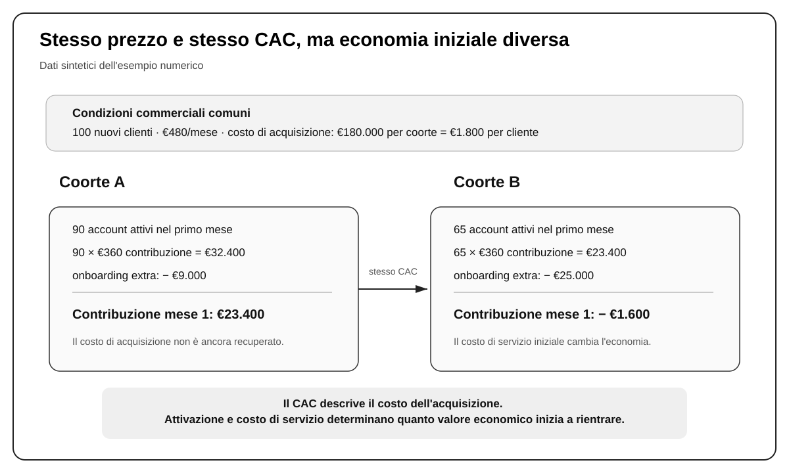
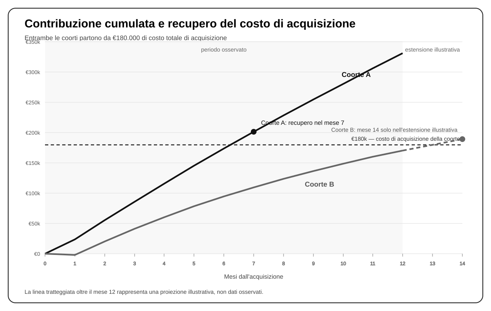

# Capitolo 25 — Economia del cliente

Una vendita racconta soltanto l'inizio della relazione economica con un cliente. Per acquisirlo l'impresa ha sostenuto un costo. Per servirlo continuerà a sostenere altri costi. Il cliente potrà comprare ancora, restare per anni, abbandonare presto, richiedere molte ore di assistenza, generare resi, pagare in ritardo o acquistare prodotti con margini molto diversi. Due clienti che oggi producono lo stesso fatturato possono quindi avere un valore economico completamente differente.

È per questo che il fatturato, pur essendo un dato essenziale, non basta a dire quanto “vale” un cliente. Anche il costo di acquisizione, osservato da solo, non basta. Sapere che un cliente è costato 1.800 euro serve a capire quanto abbiamo investito per ottenerlo; non dice ancora quanto rimarrà dopo averlo servito, quanto tempo servirà per recuperare quei 1.800 euro o quanto capitale dovremo anticipare mentre aspettiamo che la relazione produca valore.

L'economia del cliente serve a ricostruire proprio questo percorso: **quanto investiamo per creare la relazione, quanto valore economico quella relazione restituisce, in quanto tempo e con quale grado di certezza**.

La materia diventa importante non appena l'impresa deve prendere decisioni di crescita. Finché si acquisiscono pochi clienti, alcune differenze possono essere assorbite informalmente. Quando si vuole aumentare la spesa commerciale, assumere venditori, aprire nuovi canali o spingere sulla retention, le stesse differenze diventano decisive. Un cliente apparentemente profittevole può richiedere troppo capitale prima di ripagarsi. Un segmento che converte molto può costare troppo da servire. Un canale con lead economici può produrre clienti che abbandonano presto. Una media positiva può nascondere una parte del portafoglio che distrugge valore.

Per leggere questi fenomeni useremo alcuni strumenti collegati tra loro. Le **unit economics** chiariscono l'economia elementare dell'unità che stiamo vendendo. L'**analisi per coorti** permette di vedere se gruppi diversi di clienti si comportano in modo diverso nel tempo. Il **lifetime value** prova a stimare il valore economico dell'intera relazione. Il **payback** aggiunge una variabile che spesso viene trascurata: quanto tempo serve per recuperare ciò che abbiamo speso per acquisire il cliente. Da questi elementi possiamo costruire un **costo massimo sostenibile di acquisizione** e, quando vogliamo scalare, confrontarlo con il **costo marginale** dei clienti che il prossimo incremento di spesa dovrebbe produrre.

Questi strumenti non sono formule indipendenti da imparare a memoria. Sono risposte successive alla stessa domanda: **quanto possiamo investire per acquisire un cliente senza compromettere margine, cassa e capacità di crescita?**

## 25.1 Unit economics

Le unit economics partono da una scelta che sembra banale ma non lo è: qual è l'unità economica che stiamo cercando di capire?

In alcuni business l'unità naturale è un ordine. In altri è un abbonamento, un progetto, una camera occupata, una consegna, un paziente, un account o l'intera relazione con un cliente. La scelta dipende dalla decisione che dobbiamo prendere.

Un ecommerce, per esempio, può voler sapere se il **primo ordine** è profittevole, perché questo aiuta a decidere quanto può spendere per generare il primo acquisto. Ma se una parte rilevante del valore arriva dai riacquisti, il solo ordine non basta: bisogna anche studiare il cliente nel tempo. In un servizio professionale a progetto, invece, il singolo contratto può essere una buona unità di analisi se ogni incarico ha costi e margini abbastanza identificabili.

Scegliere male l'unità crea numeri formalmente corretti ma poco utili. Se un ristorante misura l'economia “per cliente” ma una parte importante dei costi cambia per tavolo, fascia oraria o canale di vendita, la media può nascondere differenze che servono davvero alla decisione. Se un software B2B misura tutto per singolo utente mentre il contratto e l'assistenza sono gestiti per account aziendale, il denominatore scelto può rendere difficile capire la vera economia della relazione.

Una volta chiarita l'unità, il primo passaggio è separare i ricavi dalla parte di costi che cresce direttamente con quella vendita o con quella relazione. Questa differenza è il **margine di contribuzione**.

> **Margine di contribuzione = ricavi − costi variabili attribuibili**

Se un servizio in abbonamento fattura 480 euro al mese e richiede mediamente 120 euro di infrastruttura, supporto e altri costi che dipendono direttamente dall'account, la contribuzione mensile è 360 euro.

Quei 360 euro non sono profitto. Devono ancora contribuire a sostenere struttura, personale non variabile, sviluppo, amministrazione, investimenti e utile. La distinzione è fondamentale perché il fatturato misura ciò che entra; la contribuzione ci dice quanto rimane disponibile prima dei costi di struttura.

Qui occorre evitare anche l'errore opposto: caricare sull'unità qualunque costo aziendale in modo arbitrario e chiamare il risultato “margine”. Per le decisioni commerciali ci interessa prima di tutto capire che cosa cambia davvero quando acquisiamo e serviamo un cliente in più. Se una sede costa 10.000 euro al mese indipendentemente dal fatto che entrino uno o dieci clienti aggiuntivi, quel costo appartiene certamente all'economia complessiva dell'impresa, ma non si comporta come un costo variabile della singola relazione.

Questo non elimina i costi fissi dal ragionamento. Semplicemente separa due domande. La prima è: **quanto contribuisce questa unità dopo i costi che genera direttamente?** La seconda, che affronteremo poi, è: **quanta di quella contribuzione deve rimanere per sostenere la struttura e il profitto?**

Accanto alla contribuzione serve il **costo di acquisizione cliente**, o CAC (*customer acquisition cost*). In forma semplice:

> **CAC = costi attribuibili di acquisizione e vendita / nuovi clienti acquisiti**

La formula è semplice. La parte difficile è decidere che cosa mettere nel numeratore e quale periodo o gruppo di clienti usare come denominatore.

Se un'impresa considera soltanto la spesa pubblicitaria, può ottenere un “CAC” molto rassicurante ma economicamente incompleto. Per trasformare un contatto in cliente possono servire anche agenzia, produzione creativa, eventi, materiali, software, tempo dei venditori, commissioni e attività di follow-up. Il perimetro corretto dipende dal sistema commerciale, ma deve essere abbastanza ampio da rappresentare il vero investimento necessario a produrre la vendita.

Questo è uno dei motivi per cui il costo per lead e il CAC rispondono a domande diverse. Un canale può generare lead da 20 euro e diventare costoso quando scopriamo che servono molte telefonate, diversi incontri e numerose proposte per arrivare a un contratto. Un altro canale può produrre lead da 80 euro ma portare persone già informate, con un bisogno più urgente e un ciclo commerciale molto più corto. Il lead più economico può quindi produrre il cliente più costoso.

Per un imprenditore la verifica pratica è semplice: quando legge il proprio costo di acquisizione dovrebbe chiedersi **quali risorse sarebbero scomparse davvero se quei clienti non fossero stati acquisiti?** Se la risposta include molto più della sola pubblicità, il numero usato in dashboard è probabilmente troppo stretto.

> **ESEMPIO NUMERICO — Economia elementare di un account**
>
> Supponiamo che un software in abbonamento abbia:
>
> - prezzo mensile: **€480**;
> - costi variabili mensili attribuibili all'account: **€120**;
> - contribuzione mensile: **€360**;
> - CAC completo: **€1.800**.
>
> La prima fattura da €480 non recupera il costo sostenuto per acquisire il cliente. Anche dopo aver sottratto i costi variabili, i €360 di contribuzione del primo mese coprono soltanto una parte dei €1.800 investiti nell'acquisizione. Il resto deve essere recuperato attraverso la contribuzione dei mesi successivi.

A questo punto emerge una difficoltà che la semplice unit economics non risolve: clienti apparentemente identici nel momento della vendita possono comportarsi in modo molto diverso dopo l'ingresso. Per vedere quella differenza dobbiamo smettere, almeno per un momento, di guardare soltanto la media.

## 25.2 Analisi per coorti

Una media è utile quando il gruppo che riassume è abbastanza omogeneo per la decisione che dobbiamo prendere. Diventa pericolosa quando mescola realtà molto diverse e ci fa credere che esista un “cliente medio” che in pratica non esiste.

Immaginiamo un'impresa con CAC medio stabile a 1.800 euro. Il dato può sembrare rassicurante. Ma quel valore potrebbe essere la media tra clienti acquisiti a 1.200 euro e clienti acquisiti a 2.400. Oppure i due gruppi potrebbero costare entrambi 1.800 euro e differire dopo la vendita: uno attiva rapidamente, usa il prodotto in modo standard e rimane a lungo; l'altro richiede implementazioni complesse, molto supporto e abbandona presto.

Il problema delle medie diventa particolarmente serio quando cambia il **mix**. Se l'impresa aumenta la quota di un segmento meno profittevole, la media complessiva può deteriorarsi lentamente e mascherare la causa. Se invece osserviamo i gruppi separatamente, il cambiamento diventa visibile molto prima.

Una **coorte** è semplicemente un gruppo di clienti che condivide una caratteristica utile e viene osservato nel tempo. La caratteristica può essere il mese di acquisizione, il canale, il segmento, il venditore, il tipo di offerta, il processo di onboarding, la fascia di prezzo o un'altra variabile che possa cambiare l'economia della relazione.

Non tutte le segmentazioni meritano di diventare coorti. Separare i clienti per colore preferito o per una variabile che non cambia alcuna decisione produce analisi, non conoscenza utile. La domanda da fare è: **se scoprissi una differenza importante tra questi due gruppi, cambierei qualcosa?** Se la risposta è no, la segmentazione probabilmente non merita attenzione operativa.

Quando invece la differenza può modificare spesa, prezzo, target, onboarding, priorità commerciale o prodotto, l'analisi per coorti diventa molto potente. Collega ciò che facciamo prima della vendita con ciò che succede dopo.

Consideriamo due coorti di cento clienti ciascuna, acquisite allo stesso costo.

> **ESEMPIO SVOLTO — Due coorti con lo stesso CAC**
>
> Dati comuni:
>
> - 100 nuovi account per coorte;
> - CAC per account: **€1.800**;
> - costo totale di acquisizione per coorte: **€180.000**;
> - prezzo: **€480/mese**;
> - contribuzione normale per account attivo: **€360/mese**.
>
> La Coorte A raggiunge 90 account attivi nel primo mese e richiede €9.000 di lavoro aggiuntivo di onboarding. La Coorte B raggiunge 65 account attivi e richiede €25.000 di onboarding aggiuntivo.
>
> Nel primo mese la Coorte A produce 90 × €360 = €32.400 di contribuzione ricorrente. Sottraendo i €9.000 di onboarding extra restano **€23.400**.
>
> La Coorte B produce 65 × €360 = €23.400; sottraendo €25.000 di onboarding extra, il primo mese chiude a **−€1.600** di contribuzione.

Il CAC non è sbagliato. Entrambe le coorti sono costate 1.800 euro per cliente acquisito. Semplicemente, il CAC descrive il costo necessario a produrre la vendita; non descrive tutto ciò che succede dopo.

La differenza di attivazione e di onboarding modifica l'economia fin dal primo mese. Se il fenomeno continua nel tempo, le due coorti possono avere retention, supporto e valore cumulato molto diversi pur partendo dallo stesso prezzo e dallo stesso costo di acquisizione.

Questa è la vera utilità manageriale delle coorti: permettono di collegare una differenza osservata a una possibile decisione. Se un certo segmento richiede il doppio del supporto, l'impresa può rivedere prezzo, processo di onboarding o criteri di acquisizione. Se un canale produce clienti che rimangono più a lungo, può meritare un CAC iniziale più alto. Se una versione dell'offerta riduce l'attivazione, può essere un problema di promessa, prodotto o implementazione.

La coorte non ci dice automaticamente che cosa cambiare, ma impedisce alla media di nascondere **dove** l'economia sta cambiando.

## 25.3 Lifetime value

Fin qui abbiamo osservato il costo di acquisizione e il comportamento di gruppi di clienti. Resta una domanda inevitabile: quanto valore economico produrrà un cliente durante l'intera relazione con l'impresa?

È la domanda a cui cerca di rispondere il **lifetime value**, o LTV.

Il concetto è semplice; l'uso corretto molto meno. La prima distinzione riguarda il tipo di valore che stiamo misurando. Se un cliente genera 10.000 euro di fatturato durante la relazione, non significa che “vale 10.000 euro” per l'impresa. Se prodotto, logistica, assistenza, resi e altri costi incrementali assorbono 7.000 euro, il valore economico disponibile prima dei costi di struttura è molto più vicino ai 3.000 euro rimanenti.

Per decisioni di acquisizione è quindi più utile una lettura basata sulla contribuzione:

> **LTV economico = contribuzione attesa lungo la relazione − costi incrementali futuri non già inclusi**

La parola più importante della formula è **attesa**. Finché il cliente non ha concluso davvero la relazione con l'impresa, una parte del lifetime value appartiene al futuro. E il futuro non è un dato: è un modello.

Supponiamo di avere dodici mesi di storia reale di una coorte. Possiamo descrivere con buona precisione quanta contribuzione ha generato in quei dodici mesi. Se vogliamo stimare i tre anni successivi dobbiamo fare ipotesi: quanti clienti resteranno, quanto compreranno, se il prezzo cambierà, se i costi di servizio rimarranno stabili, se ci saranno upsell, sconti o cambi di prodotto.

Questa distinzione tra **valore osservato** e **valore modellato** è cruciale perché il lifetime value può diventare facilmente un modo elegante per giustificare qualunque spesa di acquisizione. Basta ipotizzare una retention molto lunga, un buon tasso di riacquisto e costi stabili per costruire un LTV enorme. Il foglio di calcolo torna; il cliente reale deve ancora dimostrare di comportarsi così.

Un'impresa giovane, con poche coorti mature, dovrebbe essere particolarmente prudente. Può usare il LTV per costruire scenari, non per fingere che il futuro sia già osservato. Un'impresa con anni di dati, prodotti stabili e comportamento relativamente regolare può modellare il valore con maggiore fiducia, ma anche in quel caso deve controllare che il mercato e il mix di clienti non stiano cambiando.

Il punto pratico è questo: **più una decisione di spesa dipende da valore futuro non ancora osservato, più il margine di sicurezza deve aumentare**.

Un indicatore diffuso è il rapporto LTV:CAC. Se un cliente produce 6.000 euro di valore economico atteso e costa 2.000 euro da acquisire, il rapporto è 3:1. Il numero è comodo, ma non va trasformato in un benchmark universale.

Due imprese con lo stesso rapporto possono trovarsi in condizioni molto diverse. La prima recupera il CAC in due mesi; la seconda in diciotto. La prima ha contratti annuali pagati in anticipo; la seconda incassa mese per mese. La prima possiede molta cassa; la seconda sta già finanziando magazzino e crescita. Il rapporto sintetico è identico, la sostenibilità della crescita no.

Il rapporto LTV:CAC è quindi utile come sintesi, non come verdetto. Se non sappiamo come è stato stimato l'LTV, in quanto tempo arriva la contribuzione e quanta cassa serve per arrivarci, il rapporto rischia di essere preciso soltanto nell'aspetto.

## 25.4 Payback avanzato

Il payback introduce esattamente la variabile che il LTV tende a comprimere: **il tempo**.

Il **payback** misura quanto tempo serve affinché la contribuzione cumulata recuperi il costo sostenuto per acquisire il cliente o la coorte. Nei modelli molto regolari si può stimare dividendo il CAC per la contribuzione periodica. Quando attivazione, churn, onboarding o utilizzo cambiano nel tempo, è più informativo seguire direttamente la contribuzione cumulata.

> **Il payback viene raggiunto nel primo periodo in cui la contribuzione cumulata osservata è almeno pari al costo di acquisizione.**

Per capire perché conta, immaginiamo due clienti che produrranno entrambi 6.000 euro di contribuzione totale. Il primo restituisce i 2.000 euro spesi per acquisirlo in tre mesi. Il secondo li restituisce in quindici. A parità di valore finale, il secondo cliente obbliga l'impresa a finanziare il rapporto molto più a lungo.

Questo cambia la capacità di crescita. Se spendiamo oggi 100.000 euro in acquisizione e li recuperiamo rapidamente, una parte di quella cassa può essere reinvestita presto. Se la recuperiamo dopo un anno, la stessa crescita richiede una riserva finanziaria molto maggiore o una fonte esterna di capitale.

Il payback non dice quindi soltanto se il cliente è “buono”. Dice **quanto tempo l'impresa deve sostenere economicamente la relazione prima che l'investimento iniziale torni disponibile**.

Torniamo alle due coorti precedenti. Seguendo mese per mese gli account attivi, la Coorte A arriva a circa €173.160 di contribuzione cumulata al sesto mese e supera i €180.000 di costo di acquisizione nel settimo. La Coorte B, alla fine del dodicesimo mese, ha prodotto circa €169.760 e non ha ancora recuperato il costo iniziale.

| Metrica osservata | Coorte A | Coorte B |
|---|---:|---:|
| Nuovi account acquisiti | 100 | 100 |
| CAC per account | €1.800 | €1.800 |
| Account attivati nel mese 1 | 90 | 65 |
| Onboarding extra mese 1 | €9.000 | €25.000 |
| Account attivi nel mese 12 | 69 | 29 |
| Contribuzione cumulata a 12 mesi | €329.760 | €169.760 |
| CAC recuperato entro 12 mesi | Sì | No |
| Payback osservato | Mese 7 | Oltre il mese 12 |

La differenza non è soltanto contabile. Se l'impresa vuole raddoppiare l'acquisizione, la Coorte B richiederà molta più cassa per sostenere lo stesso ritmo di crescita. È possibile che nel lungo periodo diventi comunque profittevole, ma la crescita deve essere finanziabile prima di essere celebrata.

Questo punto vale anche fuori dagli abbonamenti. Un ecommerce può spendere oggi per acquisire un cliente, guadagnare poco sul primo ordine e recuperare il CAC grazie al secondo e al terzo acquisto. Un'impresa industriale può sostenere mesi di attività commerciale prima del primo ordine e concedere poi condizioni di pagamento a 60 o 90 giorni. In entrambi i casi il valore finale può essere positivo e il fabbisogno di cassa molto diverso.

Per questo **economia positiva** e **crescita finanziabile** non sono sinonimi. Il capitolo successivo entrerà proprio nel ciclo di cassa; qui basta fissare il legame: il tempo con cui rientra il capitale è parte della qualità economica del cliente.

## 25.5 Costo massimo di acquisizione

Una volta compresi contribuzione, coorti, LTV e payback possiamo affrontare una domanda più utile di “quanto stiamo pagando oggi un cliente?”: **quanto possiamo permetterci di pagare per acquisire un cliente di questo tipo?**

La differenza è importante. Il CAC storico descrive ciò che è successo. Il costo massimo sostenibile è invece una regola con cui decidiamo quanto siamo disposti a investire in futuro.

Non esiste un numero naturale nascosto nei dati che l'impresa deve semplicemente scoprire. La soglia dipende da dati osservati e da scelte manageriali.

Tra i dati osservati troviamo la contribuzione che clienti simili hanno prodotto, il payback, i costi di servizio e la stabilità delle coorti. Tra le scelte manageriali troviamo quanto valore vogliamo lasciare alla struttura e al profitto, quale margine di sicurezza vogliamo mantenere, quanta cassa possediamo e quanto rischio siamo disposti ad accettare.

Una possibile forma della regola è:

> **CAC massimo sostenibile = contribuzione nell'orizzonte scelto − contribuzione richiesta a struttura/profitto − margine di sicurezza per rischio e cassa**

La formula è utile proprio perché costringe a dichiarare le ipotesi. Se l'impresa non decide quanta contribuzione vuole preservare o quale orizzonte considera affidabile, “quanto posso spendere per un cliente?” rimane una domanda vaga.

> **ESEMPIO NUMERICO — Costruire una soglia di acquisizione**
>
> La Coorte A dell'esempio precedente ha prodotto nei primi dodici mesi €329.760 di contribuzione complessiva, cioè **€3.297,60 per account acquisito**.
>
> Supponiamo che l'impresa voglia riservare:
>
> - €700 per contribuire a struttura e profitto;
> - €400 come margine di sicurezza per rischio e fabbisogno di cassa.
>
> La soglia diventa:
>
> **€3.297,60 − €700 − €400 = €2.197,60**
>
> In termini operativi, l'impresa potrebbe arrotondare la propria soglia a circa **€2.200** per clienti con economia simile a quella osservata.

Il risultato non significa che 2.200 euro sia un CAC “corretto” in assoluto. Significa che, **con quell'orizzonte, quella contribuzione osservata e quei requisiti di sicurezza**, la direzione ha deciso che oltre quella cifra l'acquisizione non lascia abbastanza valore.

Se l'impresa dispone di poca cassa, può scegliere un margine di sicurezza maggiore e abbassare il tetto. Se possiede molta liquidità, coorti molto stabili e un forte vantaggio competitivo, può accettare un payback più lungo o una soglia diversa. Se un segmento produce molta più contribuzione e meno assistenza, può avere razionalmente un CAC massimo superiore a un altro segmento.

Questa è una conseguenza pratica importante: **non tutti i clienti devono avere lo stesso costo massimo di acquisizione**. Pretendere un unico CAC target per l'intera azienda può essere tanto fuorviante quanto usare un unico LTV medio per clienti con economie diverse.

La soglia va quindi costruita, documentata e rivista quando cambiano le condizioni. Non è un benchmark da cercare online; è una decisione economica dell'impresa.

## 25.6 Costo marginale e leve di crescita

La soglia diventa davvero utile quando l'impresa vuole scalare.

Il CAC storico racconta quanto sono costati mediamente i clienti già acquisiti. Ma il passato non garantisce che il prossimo blocco di spesa produca gli stessi risultati. I canali si saturano, le audience più facili vengono raggiunte prima, i venditori possono avvicinarsi alla capacità massima e la qualità delle opportunità può cambiare.

Per decidere sul prossimo investimento serve quindi il **CAC marginale**:

> **CAC marginale = spesa incrementale di acquisizione / clienti incrementali prodotti da quella spesa**

Supponiamo che il prossimo blocco di acquisizione richieda 130.000 euro addizionali e sia previsto generare 50 nuovi clienti. Il CAC marginale atteso è:

> **€130.000 / 50 = €2.600**

Se per quel tipo di cliente abbiamo costruito una soglia sostenibile di circa 2.200 euro, il nuovo blocco non soddisfa l'economia richiesta. Questo non significa che l'impresa debba rinunciare alla crescita. Significa che **non dovrebbe comprare quella crescita alle condizioni attuali senza modificare qualcosa**.

Le leve possibili non sono soltanto nel media buying. Si può lavorare sulla conversione, in modo da ottenere più clienti con la stessa spesa. Si può migliorare la contribuzione attraverso prezzo, mix o costi di servizio. Si può migliorare l'attivazione o la retention. Si può ridurre il lavoro commerciale richiesto per ogni cliente. Si può scegliere un segmento diverso o diminuire la dimensione del blocco di investimento.

Questa è una differenza sostanziale tra “scalare una campagna” e **scalare un'economia**. Nel primo caso guardiamo soprattutto a quanto budget possiamo aggiungere. Nel secondo chiediamo quale parte del sistema deve reggere perché il cliente successivo rimanga conveniente.

L'analisi di sensibilità serve proprio a capire quali variabili sono abbastanza importanti da cambiare la decisione.

Supponiamo che il prossimo gruppo di clienti richieda 600 euro in più di onboarding e assistenza iniziale per account. A parità di tutto il resto, la contribuzione a dodici mesi scenderebbe da €3.297,60 a circa €2.697,60 per cliente acquisito.

Usando la stessa regola decisionale:

> **€2.697,60 − €700 − €400 = €1.597,60**

A quel punto persino il vecchio CAC medio di €1.800 supererebbe la soglia.

Il costo di acquisizione non è cambiato; è cambiata l'economia del cliente. Questo è esattamente il motivo per cui le leve di crescita non possono essere gestite come compartimenti separati. Prezzo, conversione, attivazione, costo di servizio, retention, frequenza e acquisizione interagiscono.

Lo stesso ragionamento vale nei business senza abbonamento. Consideriamo un ecommerce in cui il primo ordine lascia 32 euro di contribuzione prima dell'acquisizione e il CAC è 24 euro. Due gruppi di clienti possono avere la stessa economia del primo ordine ma frequenze di riacquisto molto diverse. Per confrontarli bisogna osservare contribuzione cumulata, tempi degli ordini successivi, costo delle promozioni e capitale immobilizzato nelle scorte. Una formula di churn tipica di un software in abbonamento sarebbe poco adatta; il principio economico resta però identico: **seguire il valore che la relazione restituisce nel tempo e confrontarlo con ciò che abbiamo dovuto investire per crearla e sostenerla**.

Arrivati a questo punto, il quadro può essere ricomposto in modo operativo. Il CAC dice quanto abbiamo investito per ottenere il cliente. La contribuzione dice quanto valore rimane mentre lo serviamo. Le coorti ci impediscono di nascondere differenze importanti dentro una media. L'LTV estende l'analisi lungo la relazione, ma deve distinguere ciò che abbiamo osservato da ciò che stiamo prevedendo. Il payback aggiunge il tempo e quindi il fabbisogno di finanziamento. Il costo massimo sostenibile trasforma questi elementi in una regola di spesa. Il CAC marginale verifica se il prossimo incremento di crescita continua a rispettarla.

Prima di aumentare un budget di acquisizione, un'impresa dovrebbe essere in grado di rispondere almeno a queste domande con numeri ragionevoli: quanto mi costa davvero creare un cliente pagante? Quanta contribuzione produce quel tipo di cliente? In quanto tempo recupero l'investimento iniziale? Quanto del valore futuro è osservato e quanto è modellato? Quanto sono disposto a pagare senza sacrificare il rendimento richiesto e la sicurezza della cassa? Il prossimo euro di spesa mantiene ancora queste condizioni?

Se queste risposte non esistono, la crescita è in gran parte una scommessa sul volume.

Rimane però un problema che l'economia del cliente non risolve da sola. Un cliente può essere attraente sulla carta e mettere comunque sotto pressione la cassa se pubblicità, venditori, inventario, onboarding o fornitori vengono pagati molto prima che la contribuzione rientri. È la differenza tra redditività economica e disponibilità finanziaria. Il Capitolo 26 parte esattamente da qui: dal tempo con cui il denaro entra, esce e rimane immobilizzato nell'impresa.